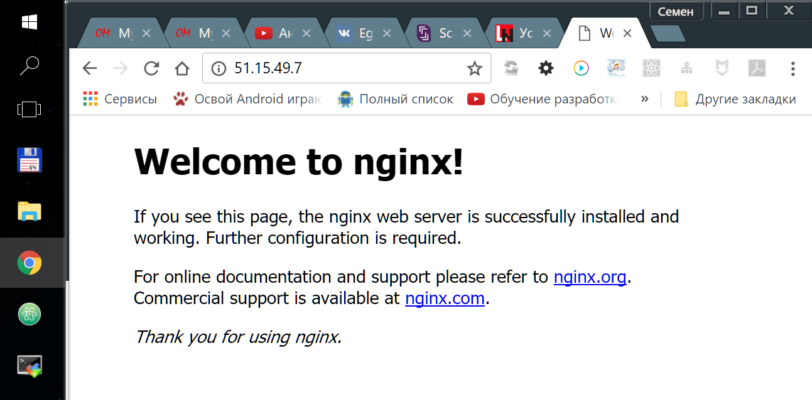
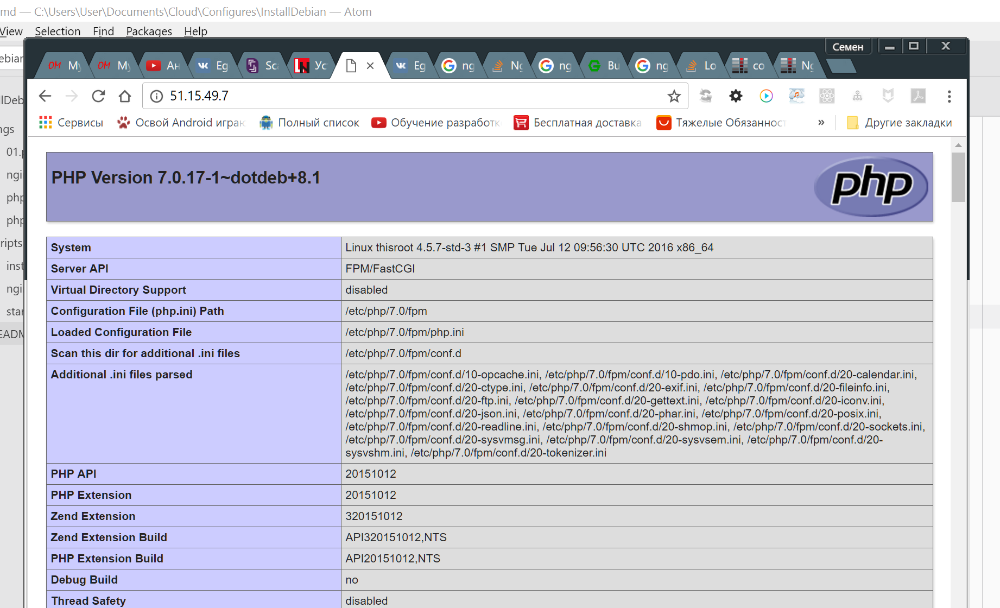
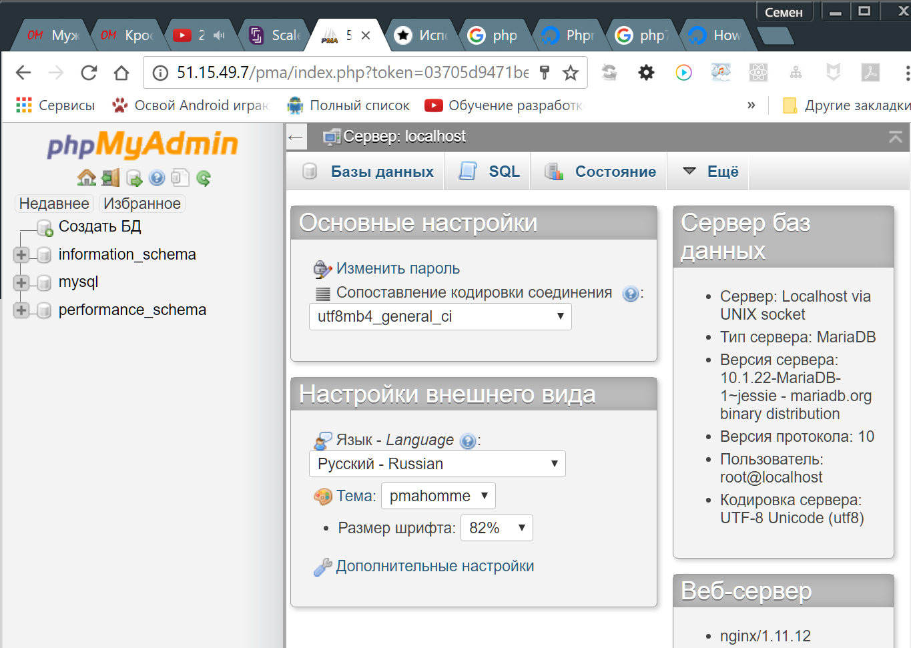
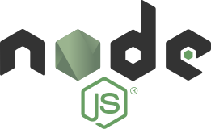
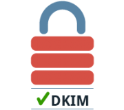
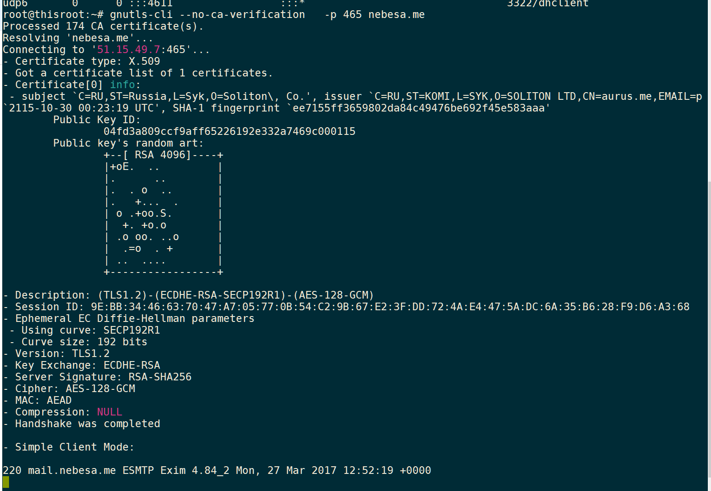
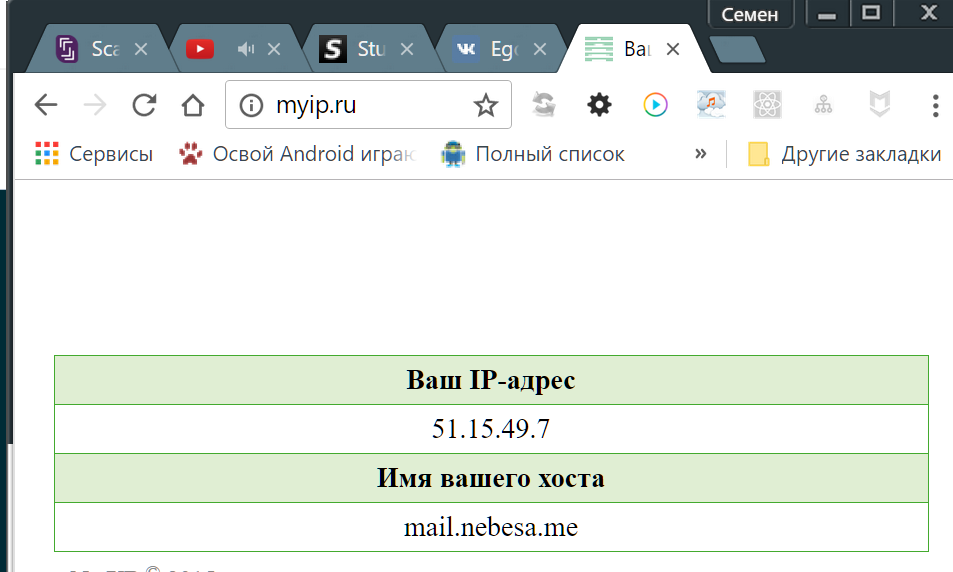

# Разворачивачивание программной инфраструктуры сервере Debian

### Оглавление

- #### Базовые компоненты
  - htop
  - mc

```sh
apt-get update
useradd --no-create-home admin
apt-get --yes --force-yes --ignore-missing install htop mc build-essential libpcre3 libpcre3-dev openssl libssl-dev

```

- #### [Компоненты веб сервера](./web)
  - **nginx** - прокси сервер
  - **php-fpm** - php интерпритатор
  - **certbot** - инструментарий для ssl
  - **maria-db** - СУБД
  - **node.js** ( + общие модули)
- #### [Почтовый IMAP, POP3 сервер](./mail)
  - **dovecot** - IMAP сервер
  - **exim4** - MTA - агент доставки почты
  - **rainloop** -веб оболочка для доступа к почтовым ящикам
- #### [Облачное хранилище](./colud)
  - **nextcloud** - облачное хранилище
- #### [Шифрование траффика сети](./ovpn)
  - **OpenVPN** - бесплатный VPN сервер
  - **Squid** - прокси сервер
  - **iptables** - сетевые настройки
- #### [Дополнительные решение](./addons)
  - **fail2ban** - anti DDoS


# Полезные команды

- `apt-cache policy <name>` - проверка текущей версии программы в репозиториях, иногда в официальных репозиториях существуют актуальные версии программ.

- `tar -pczf sites.tar.gz *` - упаковать каталог в архив

- `tar -xvzf sites.tar.gz` - распаковать каталог
- `netstat -tulpan` - просмотр прослушиваемых портов


# Компоненты веб сервера

===
nginx [engine x] — это HTTP-сервер и обратный прокси-сервер, почтовый прокси-сервер, а также TCP/UDP прокси-сервер общего назначения, изначально написанный Игорем Сысоевым. Уже длительное время он обслуживает серверы многих высоконагруженных российских сайтов, таких как Яндекс, Mail.Ru, ВКонтакте и Рамблер. Согласно статистике Netcraft nginx обслуживал или проксировал 28.50% самых нагруженных сайтов в марте 2017 года.

Можно устаовить из репозитория используя `apt-get install nginx`, но мы произведем сборку последней стабильной версии

 - Загрузим последнюю версию с [сайта](https://nginx.org/ru/download.html) разработчика

```sh

cd /opt

latestVer=$(curl -s 'http://nginx.org/en/download.html' |
   sed 's/</\'$'\n''</g' | sed -n '/>Mainline version$/,$ p' |
   egrep -m1 -o '/download/nginx-.+\.tar\.gz')

curl "http://nginx.org${latestVer}" > nginx-latest.tar.gz

tar -xzf nginx-latest.tar.gz
rm -r nginx-latest.tar.gz

useradd --no-create-home nginx

cd $(find  -maxdepth 1 -type d -name '*nginx*')

 ./configure --prefix=/usr/nginx --conf-path=/etc/nginx/nginx.conf \
  --error-log-path=/var/log/nginx/error.log \
  --http-log-path=/var/log/nginx/access.log --pid-path=/var/run/nginx.pid \
  --lock-path=/var/lock/nginx.lock --with-http_ssl_module --user=nginx \
  --group=nginx --with-http_stub_status_module --with-http_gzip_static_module

make && make install
```

- Сейчас скачаем готовый скрипт для легкого управления нашим веб -сервером nginx ( для старта, остановки, перезагрузки:

```sh
cd /etc/init.d
wget http://linux-notes.org/wp-content/uploads/scripts/start_nginx_sorce_code_Debian
mv start_nginx_sorce_code_Debian /etc/init.d/nginx
```

- Добавим права на файл ( сделаем его исполняемым) исполняемым, добавляем в автозагрузку


```sh
chmod +x /etc/init.d/nginx
update-rc.d -f nginx defaults
```

- откроем файл конфигурации `nano /etc/nginx/nginx.conf` и укажем свой ip

```
...
server {
       listen       80;
       server_name  51.15.49.7;

       #charset koi8-r;
       #access_log  logs/host.access.log  main;
...

```
Теперь запускаем сервис `service nginx start`, переходим в браузере по своему ip адресу и видим приветственное окно nginx.

##### Сконфигурируем Nginx под себя

- Заменим файл `etc/nginx/nginx.conf` [следующим](./script/nginx.conf)

- создадим каталоги для размещения конфигураций сайтов

```
mkdir /etc/nginx/sites-available
mkdir /etc/nginx/sites-enable
touch /etc/nginx/sites-available/test.conf
ln -s /etc/nginx/sites-available/test.conf /etc/nginx/sites-enabled/test.conf
```

- поместим в `test.conf` следующий код

```
server {

    listen       80;
    server_name  51.15.49.7;

		root   /var/www/test;
        index  index.php;

		location / {
		try_files $uri $uri/ /index.html;

		}

		location ~ \.php$ {
  		include fastcgi_params;
  		try_files $uri = 404;
    	fastcgi_pass unix:/var/run/php/php7.0-fpm.sock;
    	fastcgi_index index.php;
    	fastcgi_param SCRIPT_FILENAME $document_root$fastcgi_script_name;
  		fastcgi_read_timeout 600;
  		fastcgi_send_timeout 600;
		}

}
```

- перезагрузим nginx `service nginx restart`




#

===

FPM (Менеджер процессов FastCGI) является альтернативной реализацией PHP FastCGI с несколькими дополнительными возможностями обычно используемыми для высоконагруженных сайтов.


- добавим репозиторий со всежими версиями некоторых программ, установим ключ

```
echo 'deb http://packages.dotdeb.org jessie all' >> /etc/apt/sources.list
echo 'deb-src http://packages.dotdeb.org jessie all' >> /etc/apt/sources.list

cd /usr/local/src
wget https://www.dotdeb.org/dotdeb.gpg
apt-key add dotdeb.gpg
```

- обновим систему и установим php7-fpm, а так же дополнительные модули, которые будут нужны для работы некоторых систем.

```
apt-get update
apt-get install -y php7.0-fpm
apt-get install php7.0-zip php7.0-dom php7.0-gd php7.0-curl php7.0-mcrypt php-mbstring php7.0-mbstring php-gettext php7.0-mysql

phpenmod mysqli
phpenmod mcrypt
phpenmod mbstring
phpenmod zip
phpenmod dom
phpenmod gd
phpenmod curl

systemctl restart php7.0-fpm


phpenmod zip

```

- проверим работоспособность установленной версии

```
service php7.0-fpm start
```

### Размещение сайта

- создадим каталог для сайта

```sh
useradd --no-create-home www-admin
mkdir /var/www/test
touch /var/www/test/index.php
echo "<?= phpinfo(); ?>" >> /var/www/test/index.php
chown -R www-data:www-data /var/www
```

Если все нормально, то мы увидим



#

===
Let’s Encrypt — центр сертификации, начавший работу в бета-режиме с 3 декабря 2015 года[1], предоставляющий бесплатные криптографические сертификаты X.509 для TLS шифрования (HTTPS). Процесс выдачи сертификатов полностью автоматизирован.
Certbot - программа облегчающая процедуры создания, подписи и обновления сертификатов выданных Let's Encrypt.

- установим sertbot

```
sudo apt-get install certbot -t jessie-backports
```

Прежде чем создавать ssl сертификаты, необходимо настроить доменные имена для вашего ip адреса, разместить веб каталоги и прописать конфигурацию сайтов на прокси сервере

- создание сертификата

```

certbot certonly --webroot -w /var/www/nextcloud -d cloud.nebesa.me

```
#


===
MariaDB — ответвление от системы управления базами данных MySQL, разрабатываемое сообществом под лицензией GNU GPL. Разработку и поддержку MariaDB осуществляет компания MariaDB Corporation Ab и фонд MariaDB Foundation[4].
Толчком к созданию стала необходимость обеспечения свободного статуса СУБД, в противовес политике лицензирования MySQL компанией Oracle[5]. Основателями проекта выступили первоначальные разработчики MySQL[6]. Система лицензирования MariaDB обязывает участников, желающих добавить свой код в основную ветку СУБД, обмениваться своими авторскими правами с MariaDB Foundation, для охраны лицензии и возможности создавать критические исправления для MySQL

- Обратимся к официальному [репозиторию](https://downloads.mariadb.org/mariadb/repositories/)

- Добавим ключ репозитория

```
sudo apt-get install software-properties-common
sudo apt-key adv --recv-keys --keyserver keyserver.ubuntu.com 0xcbcb082a1bb943db
sudo add-apt-repository 'deb [arch=amd64,i386,ppc64el] http://ftp.igh.cnrs.fr/pub/mariadb/repo/10.1/debian jessie main'

```

- установим СУБД

```
sudo apt-get update
sudo apt-get install mariadb-server
```

- в процессе установки, программа попросит установить пароль
- проверим работоспособность программы

```
mysql -u root -p
```

- разрешим соединяться извне. Закоментируем строки

```
#skip-external-locking
#skip-networking
#bind-address = xx.xx.xx.xx
```


===
phpMyAdmin — веб-приложение с открытым кодом, написанное на языке PHP и представляющее собой веб-интерфейс для администрирования СУБД MySQL. PHPMyAdmin позволяет через браузер осуществлять администрирование сервера MySQL, запускать команды SQL и просматривать содержимое таблиц и баз данных. Приложение пользуется большой популярностью у веб-разработчиков, так как позволяет управлять СУБД MySQL без непосредственного ввода SQL команд, предоставляя дружественный интерфейс.
На сегодняшний день PHPMyAdmin широко применяется на практике. Последнее связано с тем, что разработчики интенсивно развивают свой продукт, учитывая все нововведения СУБД MySQL. Подавляющее большинство российских провайдеров используют это приложение в качестве панели управления для того, чтобы предоставить своим клиентам возможность администрирования выделенных им баз данных.


 - Установим систему управленияСУБД

```
sudo apt-get install -y phpmyadmin
 ```

- в процессе установки отказываемся настроить db-config и сконфигурировать под прокси сервер.
- пропишем в nginx конфиг нашего тестового файла следующий код

```

location /pma {
  alias /usr/share/phpmyadmin/;
  location ~ \.php$ {
    fastcgi_pass unix:/var/run/php-pool-name.sock;
    fastcgi_index index.php;
    include fastcgi_params;
    fastcgi_param SCRIPT_FILENAME $request_filename;
    fastcgi_ignore_client_abort off;
  }
  location ~* \.(js|css|png|jpg|jpeg|gif|ico)$ {
    access_log    off;
    log_not_found    off;
    expires 1M;
  }
}

```

- перейдем в браузере по алиасу `ip/pma`
- введем пароль администратора



- добавим нового суперпользователя с привелегиями и доступом извне - `%`



===
[Node или Node.js](https://nodejs.org/en/) — программная платформа, основанная на движке V8 (транслирующем JavaScript в машинный код), превращающая JavaScript из узкоспециализированного языка в язык общего назначения. Node.js добавляет возможность JavaScript взаимодействовать с устройствами ввода-вывода через свой API (написанный на C++), подключать другие внешние библиотеки, написанные на разных языках, обеспечивая вызовы к ним из JavaScript-кода. Node.js применяется преимущественно на сервере, выполняя роль веб-сервера, но есть возможность разрабатывать на Node.js и десктопные оконные приложения (при помощи NW.js, AppJS или Electron для Linux, Windows и Mac OS) и даже программировать микроконтроллеры (например, tessel и espruino). В основе Node.js лежит событийно-ориентированное и асинхронное (или реактивное) программирование с неблокирующим вводом/выводом.

```
curl -sL https://deb.nodesource.com/setup_7.x | sudo -E bash -
sudo apt-get install -y nodejs
sudo apt-get install -y build-essential
```

- проверим успех установки

```
node
console.log('hi there');
```

### Установим глобальные модули
`npm install pm2 mysql bower grunt-cli jsdom -g`


## Почтовый сервер


===
Dovecot — свободный IMAP- и POP3-сервер, разрабатываемый в расчёте на безопасность, гибкость настройки и быстродействие. Первый релиз состоялся в 2002 году.

- [полный мануал](http://unix.uz/articles/tuning/2646-ustanovka-exim-i-dovecot-bez-mysql.html)

```
apt-get install dovecot-core dovecot-imapd dovecot-pop3d
```

- Создадим группу и пользователя vmail, от имени которого будет работать Dovecot и дадим этому пользователю доступ к каталогу, в котором будет храниться почта пользователей почтовой системы.

```
 groupadd -g 120 -r vmail
 useradd -g 120 -r -u 120 vmail
 mkdir /mnt/data/vmail
 chown vmail:vmail /mnt/data/vmail
 chmod u=rwx,g=rx,o= /mnt/data/vmail
```

Я буду использовать защищённые версии протоколов IMAP и POP3, поэтому настрою в файле `/etc/dovecot/conf.d/10-auth.conf` механизмы PLAIN и LOGIN, чтобы хранить пароли в базе данных в хэшированном виде:

```
disable_plaintext_auth = no
auth_default_realm = domain.tld
auth_mechanisms = plain login
!include auth-passwdfile.conf.ext
```

Настроим использование учётных данных из файла, подобного `/etc/passwd`, прописав в файле `/etc/dovecot/conf.d/auth-passwdfile.conf.ext` следующие секции:

```
passdb {
  driver = passwd-file
  args = scheme=CRYPT username_format=%u /etc/dovecot/passwd
}

userdb {
  driver = passwd-file
  args = username_format=%u /etc/dovecot/passwd

  # Поля по умолчанию, которые могут быть заменены значениями из файла passwd
  default_fields = uid=vmail gid=vmail userdb_home=/home/vmail/%Ld/%Ln userdb_location=maildir:/home/vmail/%Ld/%Ln userdb_quota_rule=*:storage=1G

  # Поля, значения которых заменяют значения из файла passwd
  #override_fields = home=/home/vmail/%Ld/%Ln
}

```

Создадим в каталоге `/etc/dovecot` файл `passwd` и проставим права доступа:

```
cd /etc/dovecot
touch passwd
chown root:dovecot passwd
chmod u=rw,g=r,o= passwd

```

В файле /etc/dovecot/passwd могут быть следующие поля:
`user:{plain}password:uid:gid:gecos:home:shell:extra_fields`

Назначение полей:
- user - почтовый ящик (в данном случае - вместе с доменом),
- password - пароль (можно явным образом указывать алгоритм хэширования пароля),
- uid - системный идентификатор владельца файлов почты,
- gid - системный идентификатор группы владельца файлов почты,
- gecos - справочная информация о почтовом ящике (игнорируется),
- home - путь к каталогу почты,
- shell - интерпретатор (игнорируется),
- extra_fields - дополнительные настройки (квота, например).

Любое из полей может быть не определено в файле, если в настройках Dovecot указаны значения этих полей по умолчанию. При указании дополнительных полей, используемых в секции userdb необходимо перед именем поля указывать префикс «userdb_», как в примере выше, в настройках default_fields. Имеется возможность зафиксировать часть настроек почтового ящика при помощи настройки override_fields, так что значения из файла будут игнорироваться.

- Изменим форматирование отметок времени, вписав в файл /etc/dovecot/conf.d/10-logging.conf следующую настройку:
`log_timestamp = "%Y-%m-%d %H:%M:%S "`

На время отладки также можно включить другие опции из этого файла:

```
auth_verbose = yes
auth_verbose_passwords = yes
auth_debug = yes
mail_debug = yes
```

В файле `/etc/dovecot/conf.d/10-mail.conf` настроим путь к почтовым ящикам и пользователя, от имени которого dovecot будет работать с ящиками:

```
mail_location = maildir:/home/vmail/%Ld/%Ln
mail_uid = vmail
mail_gid = vmail
first_valid_uid = 120
last_valid_uid = 120
first_valid_gid = 120
last_valid_gid = 120
```

Сейчас настроим сервис, при помощи которого Exim будет проверять учётные данные почтовых клиентов. Для этого отредактируем файл `/etc/dovecot/conf.d/10-master.conf` и впишем в него настройки сервиса:
```
service auth {
  unix_listener auth-client {
    mode = 0660
    user = Debian-exim
    #group =
  }
}
```

Зададим в файле `/etc/dovecot/conf.d/15-lda.conf` адрес, с которого Dovecot будет отправлять сообщения об ошибках:
`postmaster_address = postmaster@domain.tld`

Осталось отредактировать файл `/etc/dovecot/dovecot.conf`, указав в нём адрес, на котором сервер будет ожидать подключений:
```
!include_try /usr/share/dovecot/protocols.d/*.protocol
listen = *
!include conf.d/*.conf
!include_try local.conf
```
Начальная настройка сервера окончена. Осталось перезапустить Dovecot, чтобы настройки вступили в силу:
`/etc/init.d/dovecot restart`


Если у вас имеются готовый подписанный сертификат, можно включить поддержку SSL в файле `/etc/dovecot/conf.d/10-ssl.conf` и указать в нём пути к файлам сертификата:

```
ssl = yes
ssl_cert = </etc/ssl/mail_public.pem
ssl_key = </etc/ssl/mail_private.pem
```


===
Exim4 это другой агент передачи сообщений (MTA), разработанный в университете Кембриджа для использования на UNIX системах, подключенных к интернету.

Установим SMTP-сервер Exim:
`apt-get install exim4-daemon-heavy`

Создаём файл конфигурации /etc/exim4/exim4.conf со [следующим начальным содержимым](./scripts/exim4.conf):

Сразу поменяем права доступа к файлу конфигурации:

 ```
 chmod u=rw,g=r,o= /etc/exim4/exim4.conf
 chown root:Debian-exim /etc/exim4/exim4.conf
 ```

В этом случае можно дать остальным пользователям доступ на чтение, т.к. никакой особо секретной информации в файле конфигурации нет. С другой стороны - нужды давать такой доступ тоже нет.

Чтобы Exim мог читать файл `/etc/dovecot/passwd`, включим пользователя Debian-exim в группу dovecot:
`usermod -aG dovecot Debian-exim`

Осталось запустить Exim, чтобы он начал работать в минимальной конфигурации:
`/etc/init.d/exim4 start`



===
Технология DomainKeys Identified Mail (DKIM) объединяет несколько существующих методов антифишинга и антиспама с целью повышения качества классификации и идентификации легитимной электронной почты. Вместо традиционного IP-адреса, для определения отправителя сообщения DKIM добавляет в него цифровую подпись, связанную с именем домена организации. Подпись автоматически проверяется на стороне получателя, после чего, для определения репутации отправителя, применяются «белые списки» и «чёрные списки».

Для удобного создания ключей DKIM-подписей можно установить пакет opendkim-tools:
`apt-get install opendkim-tools`
На самом деле необходимые ключи можно генерировать и при помощи openssl, т.к. пакет opendkim-tools содержит набор shell-скриптов, являющихся обёрткой над утилитой openssl.

Теперь создадим каталог для ключей и сгенерируем пару ключей для домена domain.tld:

```
mkdir /etc/exim4/dkim
cd /etc/exim4/dkim
opendkim-genkey -D /etc/exim4/dkim/ -d domain.tld -s mail
mv mail.private mail.domain.tld.private
mv mail.txt mail.domain.tld.public
```

Далее можно сгенерировать ключи для других доменов, обслуживаемых нашей почтовой системой.

Выставим права доступа к файлам приватных ключей:

```
cd /etc/exim4/dkim
chmod u=rw,g=r,o= *
chown root:Debian-exim *
```

Добавляем в секцию транспортов файла /etc/exim4/exim4.conf, в транспорт remote_smtp, настройки для добавления DKIM-подписей к письмам:

```
remote_smtp:
  driver = smtp
  dkim_domain = ${lc:${domain:$h_from:}}
  dkim_selector = mail
  dkim_private_key = ${if exists{/etc/exim4/dkim/$dkim_selector.$dkim_domain.private} \
                                {/etc/exim4/dkim/$dkim_selector.$dkim_domain.private}{}}
```

Достаточно перезагрузить конфигурацию, чтобы письма во внешние домены начали подписываться DKIM-ключами:
`/etc/init.d/exim4 reload`

Проверим работоспособность

`gnutls-cli --no-ca-verification   -p 465 nebesa.me` или
`openssl s_client -showcerts -connect nebesa.me:465`




===
RainLoop - современная, лёгкая и быстрая веб-панель для работы с почтой. Поддерживает подключения по протоколам IMAP и SMTPsmtp.

```
cd /opt
wget repository.rainloop.net/v2/webmail/rainloop-latest.zip
mkdir /var/www/rainloop
unzip rainloop-latest.zip -d /var/www/rainloop
find /var/www/rainloop -type d -exec chmod 755 {} \;
chown -R www-data:www-data /var/www/rainloop
```

- прописываем [конфиг](./script/rainloop.conf) в nginx, и не забудем создать сертификаты

- заходим по адресу `http://webmail.domain.com/?admin`, при первом входе логин:admin, пароль: 12345, меняем пароль и конфигурируем под себя.


- Для настроенных exim и dovecot работает следующий конфиг доменов

```
imap_host = "mail.nebesa.me"
imap_port = 993
imap_secure = "SSL"
imap_short_login = Off
sieve_use = Off
sieve_allow_raw = Off
sieve_host = ""
sieve_port = 4190
sieve_secure = "None"
smtp_host = "127.0.0.1"
smtp_port = 465
smtp_secure = "SSL"
smtp_short_login = Off
smtp_auth = On
smtp_php_mail = Off
white_list = "mail@nebesa.me tomov.vladimir@nebesa.me mikheev.egor@nebesa.me"
```

## Облачное хранилище


===
Nextcloud предоставляет средства для обеспечения совместного доступа, версионный контроль изменений, поддержку воспроизведения медиаконтента и просмотра документов прямо из web-интерфейса, возможность синхронизации данных между разными машинами, возможность просмотра и редактирования данных с любого устройства в любой точке сети. Доступ к данным может быть организован как при помощи web-интерфейса, так и с использованием протокола WebDAV и его расширений CardDAV и CalDAV. В отличие от сервисов Google Drive, Dropbox, Яндекс.Диск и box.net, проекты ownCloud и Nextcloud дают пользователю полный контроль над своими данными - информация не привязывается ко внешним закрытым облачным системам хранения, а размещается на подконтрольном пользователю оборудовании.

- устанавливаем все модули php в вышеприведенном разделе
- следуем инструкциям по установке на сайте разработчика, проще всего через web установку
- прописываем [конфигурацию](./scripts/nextcloud.conf) для nginx


## Шифрование сети

===
Полный [мануал по настройке](https://habrahabr.ru/post/233971/)

- `server.conf`

```
tls-auth ta.key 0
cipher DES-EDE3-CBC
client-config-dir /etc/openvpn/staticip
port 2342
proto udp
dev tun
ca ca.crt
cert server.crt
key server.key  # This file should be kept secret
dh dh2048.pem
server 10.8.0.0 255.255.255.0
ifconfig-pool-persist ipp.txt
push "redirect-gateway def1 bypass-dhcp"
push "dhcp-option DNS 8.8.8.8"
push "dhcp-option DNS 8.8.4.4"
client-to-client
keepalive 10 120
comp-lzo
max-clients 10
persist-key
persist-tun
status openvpn-status.log
log         /var/log/openvpn-status.log
log-append /var/log/ openvpn.log
verb 3
```


- `client-config-dir /etc/openvpn/staticip` - с помошью этой строки каждому устройству присваивается постоянный ip, в каталоге создаются файлы с именами клиентских конфигов в которых содержится информация о присваиваемым им адресам, это может быть полезным, через эту подсеть можно взаимодействовать между устройствами

mob1

```
ifconfig-push 10.8.0.22 10.8.0.0″
```
pc1

```
ifconfig-push 10.8.0.50 10.8.0.0″
```

### Squid

===
[мануалы](http://itadept.ru/freebsd-squid/)
[и этот](http://wiki.squid-cache.org/ConfigExamples/Intercept/LinuxDnat)


`squid.conf`

```
acl localnet src 10.8.0.0/24
acl SSL_ports port 443
acl Safe_ports port 80		# http
acl Safe_ports port 21		# ftp
acl Safe_ports port 443		# https
acl Safe_ports port 70		# gopher
acl Safe_ports port 210		# wais
acl Safe_ports port 1025-65535	# unregistered ports
acl Safe_ports port 280		# http-mgmt
acl Safe_ports port 488		# gss-http
acl Safe_ports port 591		# filemaker
acl Safe_ports port 777		# multiling http
acl CONNECT method CONNECT

http_access allow localnet

http_access deny all
cache deny all

http_port 3128
http_port  3129 intercept
https_port 3130 intercept ssl-bump  generate-host-certificates=on dynamic_cert_mem_cache_size=4MB cert=/opt/squid/etc/squidCA.pem
ssl_bump none
ssl_bump server-first all
sslproxy_cert_error allow all
sslproxy_flags DONT_VERIFY_PEER


httpd_suppress_version_string on
via off
forwarded_for transparent
reply_header_access X-Cache deny all
reply_header_access X-Cache-Lookup deny all
request_header_access Cache-Control deny all

coredump_dir /opt/squid/var/cache/squid

refresh_pattern ^ftp:		1440	20%	10080
refresh_pattern ^gopher:	1440	0%	1440
refresh_pattern -i (/cgi-bin/|\?) 0	0%	0
refresh_pattern .		0	20%	4320

```


### iptables

```

iptables  -A INPUT -i tun0  ! -s 10.8.0.0/24  -j DROP

iptables -t nat -A PREROUTING -i tun0 -p tcp -m tcp --dport 80 -j REDIRECT --to-ports 3129

iptables -A FORWARD -s 10.8.0.0/24 -j ACCEPT
iptables -A FORWARD -m state --state RELATED,ESTABLISHED -j ACCEPT
iptables -t nat -A POSTROUTING -s 10.8.0.0/24 -o eth0 -j MASQUERADE
```

Разрешаем форвардинг
`/etc/sysctl.conf`

```
# Controls IP packet forwarding
net.ipv4.ip_forward = 1

# Controls source route verification
net.ipv4.conf.default.rp_filter = 0

# Do not accept source routing
net.ipv4.conf.default.accept_source_route = 0
```


